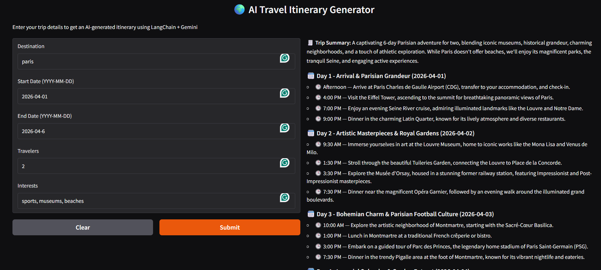

# AI Travel Itinerary Generator

A small end-to-end AI application that generates structured travel itineraries using FastAPI, LangChain, Google Gemini, Pydantic, and a Gradio frontend.

The project takes a user's trip details, sends them to a FastAPI backend, asks Gemini to create a day-by-day plan, parses the model output into a strict Pydantic schema, and returns a readable itinerary in the UI.



## What This Project Does

This app helps generate a travel plan from a few inputs:

- destination
- trip start date
- trip end date
- number or type of travelers
- travel interests

The result is a structured itinerary that includes:

- a trip summary
- daily themes
- dated day plans
- timed activities for each day

## Core Stack

- Python for the application code
- FastAPI for the backend API
- LangChain for prompt orchestration and model integration
- Google Gemini (`gemini-2.5-flash`) as the LLM
- Pydantic for input and output schemas
- Gradio for the frontend UI
- Requests for frontend-to-backend communication
- python-dotenv for environment variable loading

## Project Structure

```text
seminar/
|-- main.py
|-- frontend.py
|-- models.py
|-- requirements.txt
|-- start.sh
|-- agent_tutorial.ipynb
|-- README.md
|-- .env
|-- .env.local
|-- .gitignore
|-- ppts/
|-- .gradio/
|-- venv/
|-- __pycache__/
```

## File-By-File Breakdown

### `main.py`

This is the FastAPI backend.

Responsibilities:

- loads environment variables from `.env`
- reads `GOOGLE_API_KEY`
- creates the FastAPI app
- enables permissive CORS for frontend access
- initializes the Gemini chat model through `langchain_google_genai`
- defines the structured output parser using the `Itinerary` Pydantic model
- builds the prompt template
- exposes the `POST /generate_itinerary` endpoint

Important implementation details:

- FastAPI app title: `AI Itinerary Generator`
- app version: `1.0`
- Gemini model: `gemini-2.5-flash`
- temperature: `0.7`
- top-p: `0.9`
- if `GOOGLE_API_KEY` is missing, the app raises a startup error
- all API errors are returned as HTTP 500 with a wrapped error message

### `frontend.py`

This is the Gradio frontend.

Responsibilities:

- collects user trip inputs
- sends a JSON payload to the FastAPI backend at `http://127.0.0.1:8000/generate_itinerary`
- renders the returned itinerary in Markdown
- launches a shareable Gradio session using `ui.launch(share=True)`

Frontend inputs:

- destination
- start date
- end date
- travelers
- interests

Frontend output:

- Markdown-formatted itinerary

Current implementation notes:

- the frontend expects the backend to already be running on port `8000`
- the file currently contains some mojibake in emoji characters, but functionality is still readable enough to follow the response formatting logic
- importing this file directly will launch the Gradio app because `ui.launch(...)` runs at module level

### `models.py`

This file contains the Pydantic schemas used by the backend.

Defined models:

- `Activity`
  - `time: str`
  - `description: str`
  - `location: Optional[str]`
  - `details: Optional[str]`
- `DayPlan`
  - `day: int`
  - `date: str`
  - `theme: str`
  - `activities: List[Activity]`
- `Itinerary`
  - `destination: str`
  - `startDate: str`
  - `endDate: str`
  - `summary: str`
  - `dailyPlans: List[DayPlan]`
- `TripDetails`
  - `destination: str`
  - `startDate: str`
  - `endDate: str`
  - `travelers: str`
  - `interests: str`

Why this matters:

- request validation is handled through `TripDetails`
- response structure is enforced through `Itinerary`
- LangChain uses `PydanticOutputParser` to guide Gemini toward structured output that matches the schema

### `requirements.txt`

This contains the Python dependencies.

Packages currently listed:

- `langchain`
- `langchain-core`
- `langchain-community`
- `langchain-classic`
- `langchain-google-genai`
- `langgraph`
- `google-generativeai`
- `google-genai`
- `fastapi`
- `uvicorn`
- `pydantic`
- `streamlit`
- `gradio`
- `notebook`
- `ipykernel`
- `numpy`
- `pandas`
- `scikit-learn`
- `matplotlib`
- `python-dotenv`
- `requests`
- `tqdm`
- `datetime`

Dependency note:

- several packages are not required by the currently active FastAPI + Gradio itinerary flow, such as `streamlit`, `numpy`, `pandas`, `scikit-learn`, `matplotlib`, and `tqdm`
- `datetime` is listed even though it is part of Python's standard library and typically does not need to be installed from `requirements.txt`
- the file appears to support both experimentation and the app runtime, not just the minimal production dependency set

### `start.sh`

This is the startup helper script.

What it does:

1. starts Uvicorn in the background on `127.0.0.1:8000`
2. waits 3 seconds
3. runs `python frontend.py`

Script contents:

```bash
#!/bin/bash
uvicorn main:app --reload --host 127.0.0.1 --port 8000 &
sleep 3
python frontend.py
```

Important note:

- this script is Bash-oriented, so it works naturally in Git Bash, WSL, Linux, or macOS
- it is not a native PowerShell startup script, even though the repo may be opened on Windows

### `agent_tutorial.ipynb`

This notebook appears to be a separate experimentation or learning artifact related to Gemini agent workflows.

Observed details:

- it contains Gemini-related code and agent experiments
- it is not imported by the FastAPI backend or Gradio frontend
- it looks like a development/tutorial notebook rather than part of the production app path

### `.env`

This local environment file is used by `main.py` through `load_dotenv()`.

Expected variable:

```env
GOOGLE_API_KEY=<your_google_api_key>
```

Important security note:

- `.env` is meant for local secrets and is ignored by Git in `.gitignore`
- do not commit real API keys to source control

### `.env.local`

This file currently acts like a template/example environment file and includes a placeholder for `GOOGLE_API_KEY`.

This is useful as a safer reference file for collaborators.

### `.gitignore`

Ignored paths:

- `venv/*`
- `__pycache__/*`
- `ppts/*`
- `.gradio/*`
- `.env`

This indicates the repo intentionally excludes:

- the virtual environment
- Python cache files
- local Gradio state
- presentation files under `ppts`
- local secrets

## How The App Works

### End-to-End Flow

1. the user opens the Gradio interface
2. the user enters trip details
3. `frontend.py` sends a `POST` request to `http://127.0.0.1:8000/generate_itinerary`
4. FastAPI receives the payload as a `TripDetails` object
5. LangChain formats the system and human prompts
6. Gemini generates an itinerary
7. `PydanticOutputParser` parses the response into the `Itinerary` schema
8. FastAPI returns structured JSON
9. Gradio converts that JSON into Markdown and displays it

### Backend Prompt Logic

The backend prompt contains:

- a system message that tells the model it is a travel planning assistant
- parser format instructions injected from `PydanticOutputParser`
- a human message containing destination, dates, travelers, and interests

This design helps the model return structured output instead of free-form text.

## API Documentation

### Endpoint

`POST /generate_itinerary`

### Request Body

```json
{
  "destination": "Paris, France",
  "startDate": "2026-04-10",
  "endDate": "2026-04-13",
  "travelers": "2 adults",
  "interests": "art, cafes, museums, local food"
}
```

### Response Shape

```json
{
  "destination": "Paris, France",
  "startDate": "2026-04-10",
  "endDate": "2026-04-13",
  "summary": "A curated Paris trip blending culture, food, and iconic city experiences.",
  "dailyPlans": [
    {
      "day": 1,
      "date": "2026-04-10",
      "theme": "Arrival and Central Paris",
      "activities": [
        {
          "time": "10:00 AM",
          "description": "Check in and explore a nearby cafe",
          "location": "Paris city center",
          "details": "Keep the first day relaxed after travel"
        }
      ]
    }
  ]
}
```

### Error Behavior

If something goes wrong in the backend, the API returns:

- status code: `500`
- message format: `Error generating itinerary: <original error>`

Possible causes:

- missing API key
- invalid Gemini response format
- parsing failure in `PydanticOutputParser`
- Google API or network issues

## Setup Instructions

### 1. Create and activate a virtual environment

Windows PowerShell:

```powershell
python -m venv venv
.\venv\Scripts\Activate.ps1
```

Git Bash:

```bash
python -m venv venv
source venv/Scripts/activate
```

Linux/macOS:

```bash
python -m venv venv
source venv/bin/activate
```

### 2. Install dependencies

```bash
pip install -r requirements.txt
```

### 3. Configure environment variables

Create or update `.env`:

```env
GOOGLE_API_KEY=<your_google_api_key>
```

### 4. Start the backend

```bash
uvicorn main:app --reload --host 127.0.0.1 --port 8000
```

### 5. Start the frontend

In a separate terminal:

```bash
python frontend.py
```

### Optional: Use the helper script

If you are using Bash:

```bash
bash start.sh
```

## Running on Windows

Because `start.sh` is a Bash script, the cleanest Windows options are:

### Option 1: Run backend and frontend manually in PowerShell

Terminal 1:

```powershell
uvicorn main:app --reload --host 127.0.0.1 --port 8000
```

Terminal 2:

```powershell
python frontend.py
```

### Option 2: Use Git Bash or WSL

```bash
bash start.sh
```

## Local URLs

Typical local endpoints:

- FastAPI backend: `http://127.0.0.1:8000`
- FastAPI docs: `http://127.0.0.1:8000/docs`
- Gradio UI: shown in terminal when `frontend.py` starts

Because `share=True` is enabled in Gradio, a temporary public share link may also be created when the UI launches.

## Development Notes

### Syntax status

A basic syntax compilation check passes for:

- `main.py`
- `models.py`
- `frontend.py`

### Current design strengths

- simple architecture
- clear separation between backend, schema, and UI
- structured output parsing reduces LLM response ambiguity
- FastAPI auto-docs make testing easier
- easy to demo locally

### Current limitations and caveats

- there is no validation that `startDate` is before `endDate`
- there is no validation for traveler format or interest formatting
- there is no retry or fallback handling for model failures
- all exceptions are collapsed into a generic HTTP 500 response
- CORS is fully open (`allow_origins=["*"]`)
- the frontend is tightly coupled to a hardcoded backend URL
- the frontend launches immediately on import because launch is not guarded by `if __name__ == "__main__":`
- the dependency list is broader than the actual runtime needs
- `start.sh` is not cross-platform by default
- the notebook is separate from the deployed app flow

## Suggested Minimal Improvements

If this project evolves further, the highest-value next steps would be:

1. move secrets to a documented `.env.example` pattern and keep real keys only in local `.env`
2. add request validation for dates and travelers
3. add `if __name__ == "__main__":` around Gradio launch
4. split dev dependencies from runtime dependencies
5. add logging and friendlier backend error handling
6. make the frontend API URL configurable through environment variables
7. add tests for schema validation and API behavior
8. create a PowerShell startup script for Windows users

## Example Use Cases

- generating a vacation plan for a city trip
- producing a sample AI demo for a seminar or workshop
- showing LangChain structured output parsing with Gemini
- demonstrating how FastAPI and Gradio can work together in one local project

## Who This Project Is Good For

This repository is a good fit for:

- beginners learning how to connect an LLM to a web app
- students building a seminar or classroom demo
- developers experimenting with structured travel-planning outputs
- anyone who wants a compact LangChain + Gemini sample project

## Summary

This project is a local AI travel itinerary generator built around a straightforward architecture:

- `frontend.py` collects user inputs
- `main.py` sends those inputs through LangChain to Gemini
- `models.py` defines the expected data contracts
- the result is returned as a structured itinerary and displayed in Gradio

It is simple, understandable, and demo-friendly, with a few cleanup opportunities if you want to make it more production-ready.
